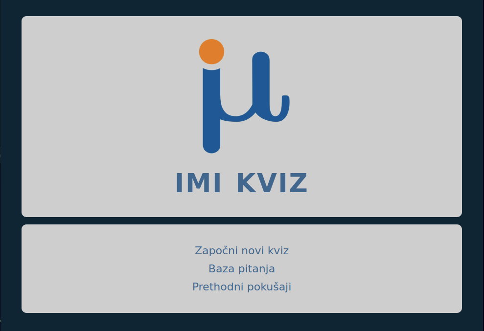
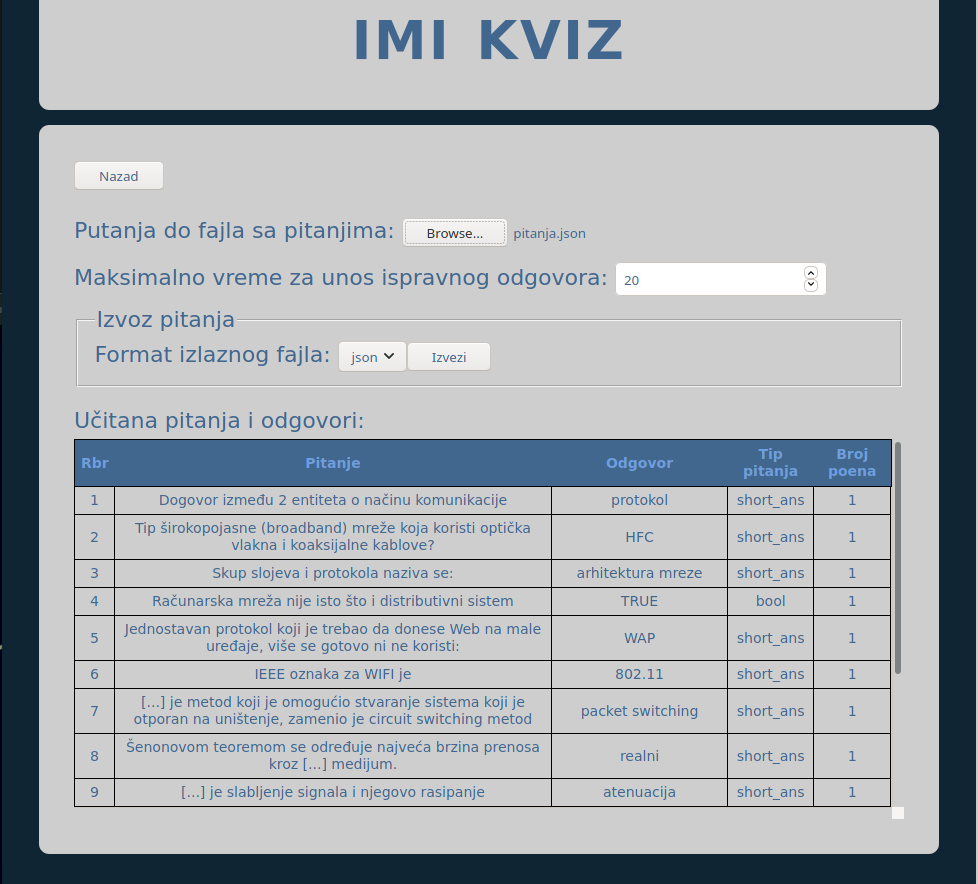
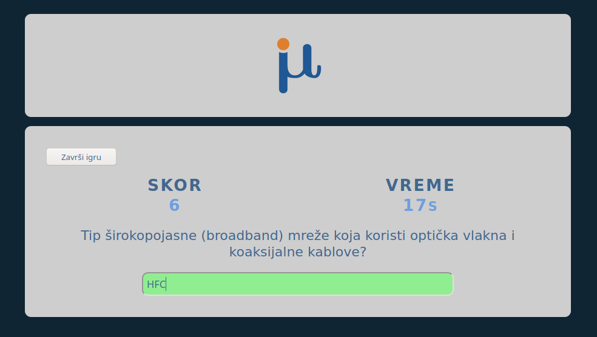
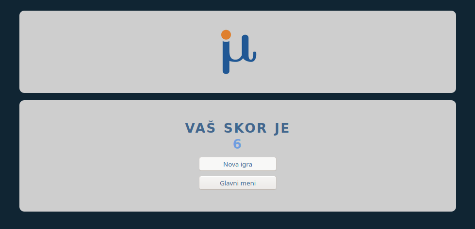
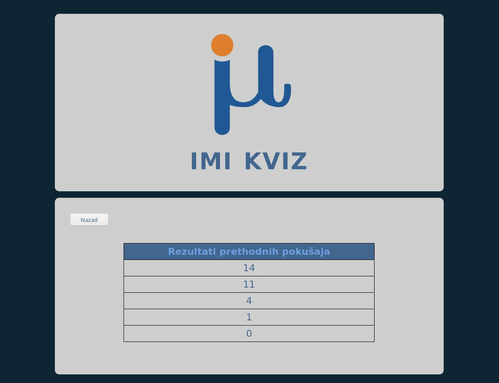

# O projektu

## Opšte informacije

[**IMI Kviz**][site] je Web aplikacija koja predstavlja kviz čija su pitanja kreirana od strane korisnika. Napravljena je kao seminarski rad iz predmeta "Klijentske Web tehnologije".


## Baza pitanja


IMI Kviz može da učita pitanja iz JSON i CSV fajlova.  

CSV fajl mora imati sledeće zaglavlje: `Pitanje,Odgovor,Tip,Vrednost`.

JSON fajl treba sadržati niz objekata:
```
[{"Pitanje":"tekst 1. pitanja","Odgovor":"odgovor na 1. pitanje","Tip":"short_ans","Vrednost":"1"},
{"Pitanje":"tekst 2. pitanja","Odgovor":"odgovor na 2. pitanje","Tip":"short_ans","Vrednost":"5"},
  .
  .
  .
{"Pitanje":"tekst n. pitanja","Odgovor":"odgovor na n. pitanje","Tip":"short_ans","Vrednost":"10"}]
```

`Tip` predstavlja tip pitanja i može imati vrednosti: `bool` ili `short_ans` (trenutno je podržan samo tip `short_ans`).  
  
`Vrednost` predstavlja vrednost tog pitanja, tj. broj poena koji će biti osvojen ukoliko se da tačan odgovor

# Slike

<div style="text-align: center">
  
  
  
  
  
</div>

[//]: # ( Reference )

[site]: https://todorovicsrdjan.github.io/IMI-kviz/
